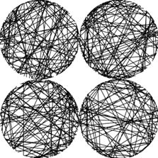

# Generative Artowrk - Computer Assisted Drawing Machine

  

Computational systems allow for the realization and expression of ideas that are impossible in other media, or in reality. In such a way, generative computer art is a medium of expression beyond the realm of conventional art, one in which difference can be created within indifference.  

Georg Nees was a German academic who is considered one of the pioneers of computer art and generative graphics. While working as an engineer for the Siemens Corportation at Erlangen, Germany, Nees came in touch with a newly acquired Graphomat Z64. This high-precision flat-bed drawing machine was intended to test-draw the movements of tools on numerically controlled machines. With strong interests in art and drawing, Nees soon realised the possibilities of using the machine for aesthetic purposes. So sometime in the Spring of 1964, Nee’s watched as the machine produced three abstract drawings. While observing the machine generate these first programmed drawings, he told himself, “Here something is emerging that will not again disappear”. (Nake, F.  2009)
 
Nees was interested in the relationship between order and disorder in picture composition. This is reflected in the untitled artwork at the top of the page; Here Nees has introduced random variables into the computer program to produce the disordered lines. These lines are framed within the ordered circles to produce a striking contrast. Upon close examination of the artwork, non-geometrical structures seem to appear from the disordered lines. This is enhanced through the absence of any border around the circular frames, allowing ordered structures to appear without fixing them to any definitive geometrical forms. 

This artwork served as the inspiration for my own exploration into the practice of generative computer art. I sought to create a program which would produce ordered patterns from the intersection of two seemingly disordered sets of lines. The absence of any border around the pattern is designed to evoke a sense of curiosity towards the direction and origin of the lines. The experience of being drawn into the pattern before the program generates a new pattern, is a provocative source of thought for the viewer about whether machines can produce works of artistic value.

## References

McCormack, J., Bown, O., Dorin, A., McCabe, J., Monro, G. and Whitelaw, M. (2012). Ten Questions Concerning Generative Computer Art.

Medienkunstnetz.de. (n.d.). Media Art Net | Generative Tools | Computer Art. [online] Available at: http://www.medienkunstnetz.de/themes/generative-tools/computer_art/ [Accessed 22 Mar. 2019].

Nake, F. (2009). The Semiotic Engine: Notes on the History of Algorithmic Images in Europe. Art Journal, 68(1), pp.76-89.

Nees, G. (1976). Untitled. [Generative Computer Art] http://recodeproject.com/.
